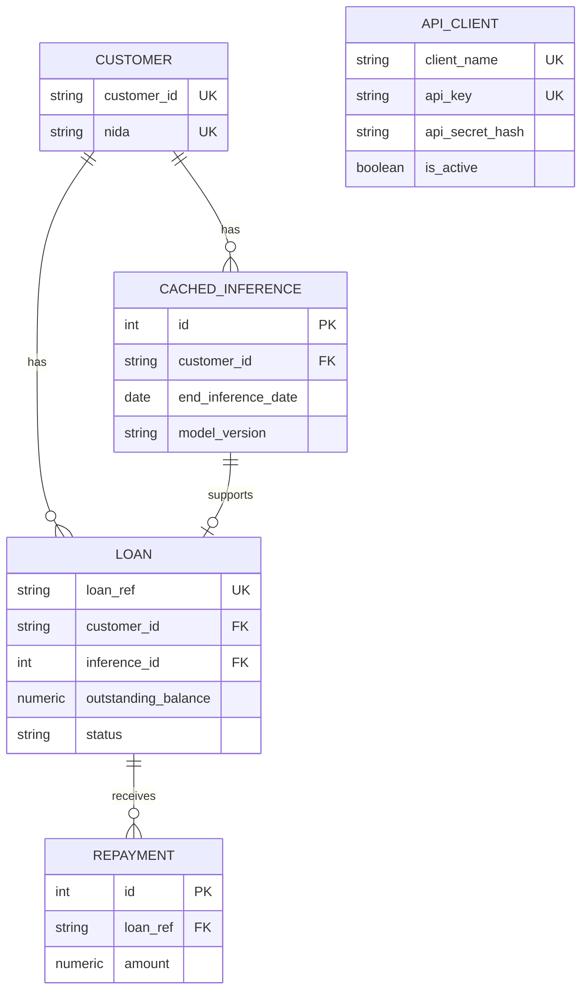

# Authentication, Responses, and Local Data Schema

The API has two authorization layers. `app.auth_router` manages API clients under `/auth`; `app.auth.require_api_auth` protects business routes. `app.main` registers the auth router without a global dependency, then explicitly adds the auth dependency to fraud and individual credit/loan handlers. Thus `/`, `/health`, and client-management routes are not API-key protected; the client-management routes require the separate admin bearer token.

## Client lifecycle

| Endpoint | Authorization | Behavior |
|---|---|---|
| `POST /auth/clients` | `Authorization: Bearer <ADMIN_TOKEN>` | Creates a unique named client, generates `ak_…` and `as_…`, bcrypt-hashes only the secret, and returns the raw secret once. |
| `GET /auth/clients?page=&limit=` | admin bearer | Lists summary fields only; pagination is bounded to 1–100 items and never exposes secret hashes. |
| `DELETE /auth/clients/{api_key}` | admin bearer | Marks the client inactive rather than deleting it. |

`_require_admin` returns `503 ADMIN_TOKEN_NOT_CONFIGURED` if no server token exists and `401 ADMIN_AUTH_FAILED` for a bad/missing bearer value. Creation returns `409 CLIENT_ALREADY_EXISTS` on duplicate client name. The raw secret is intentionally unrecoverable after the create response; callers must store it outside the API.

For protected endpoints the client supplies `api-key` and `api-secret` headers. `require_api_auth` looks up an active `ApiClient` by key and bcrypt-verifies the secret. Absent either header returns `401 MISSING_API_CREDENTIALS`; an unknown/inactive key or a mismatched secret returns `401 INVALID_CREDENTIALS`. With `REQUIRE_HTTPS=true`, a non-HTTPS request is rejected first with `403 HTTPS_REQUIRED`. When `ENFORCE_KEY_EXPIRY=true` and a non-null `expires_at` is in the past, the result is `403 API_KEY_EXPIRED`; null expiry is never expired. It updates `last_used_at` opportunistically; an update failure rolls back without rejecting an otherwise valid request. `DISABLE_AUTH=true` bypasses all API-key checks and manufactures a development client, so no credential failure applies in that demo-only mode.

## HTTP envelope and correlation

`RequestIDMiddleware` runs for every request. It preserves an incoming `X-Request-Id` or creates `req_` plus 12 hexadecimal characters, attaches it to `request.state`, and returns it in the `X-Request-Id` response header. `app.utils.response` is the canonical response surface:

```json
{
  "success": true,
  "message": "…",
  "data": {},
  "error": null,
  "meta": {
    "timestamp": "UTC ISO-8601",
    "requestId": "req_…",
    "pagination": null
  }
}
```

`success_response` JSON-encodes Pydantic and SQLAlchemy-friendly values. `error_response` replaces `data` with `null` and has `error.code` plus optional `error.details`. Main-level exception handlers convert `HTTPException`, Pydantic validation (`422 VALIDATION_ERROR`), and unexpected exceptions (`500 INTERNAL_ERROR`) into that envelope. New handlers and routes should use these helpers rather than returning a plain FastAPI dictionary, or the API contract fragments.

## Local PostgreSQL ownership

`app.database` creates the SQLAlchemy engine from mandatory `DATABASE_URL` with pre-ping, a 10-connection pool, burst capacity of 20, and a 10-second connection timeout. At import, `main.py` calls `models.Base.metadata.create_all(bind=engine)`. There are no migrations: schema evolution must be managed deliberately because `create_all` only creates absent tables and will not alter existing production columns.



The local service tables are `customers`, `cached_inferences`, `loans`, `repayments`, and `api_clients`. They are distinct from external source-system tables read by feature extraction and from MLflow's own metadata tables, even though Compose points the API at the database named by MLflow environment variables. Relationship-level `delete-orphan` cascades apply from Customer to cached inferences/loans and Loan to repayments.

## Focused validation

- Set a temporary admin token in a private environment, call `POST /auth/clients`, then use the returned headers on `/predict`. Confirm an invalid secret receives `INVALID_CREDENTIALS` and a revoked key no longer works.
- Send `X-Request-Id: trace-example` to `/health` and verify that exact header and `meta.requestId` return.
- Exercise a malformed body against a Pydantic endpoint and assert the `422` response remains an envelope with `VALIDATION_ERROR`.
- Before changing models, update all consumers in `main.py`, `auth.py`, `auth_router.py`, and the domain page that relies on the changed entity; no migration/test framework exists in the tracked repository.
