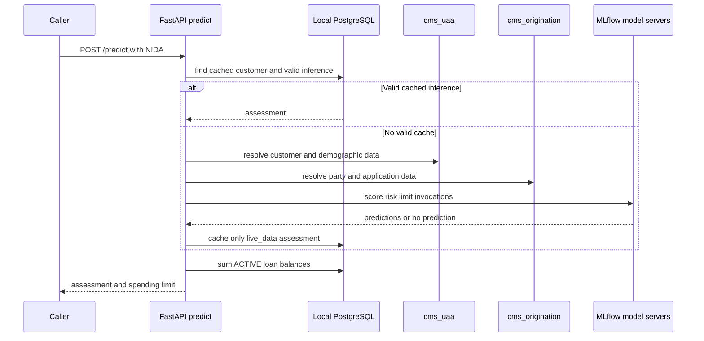
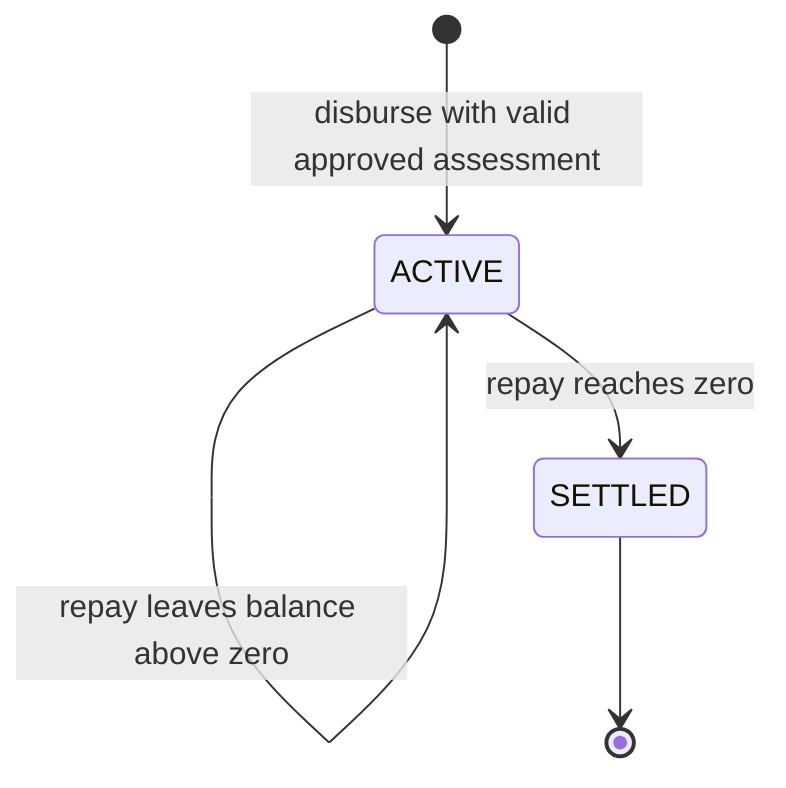

# Credit Assessment and Loan Lifecycle

`fastapi/app/main.py` owns the credit and loan routes. All routes in this page except `/` and `/health` use `require_api_auth`; they return the shared envelope described in [authentication and contracts](auth-and-contracts.md). Its primary upstream inputs are local PostgreSQL plus optional external `cms_uaa` and `cms_origination` sessions. Its primary downstream calls are MLflow serving endpoints and MLflow tracking/registry.

## Routes and change surface

| Route | Handler | Input / key output | Critical behavior |
|---|---|---|---|
| `POST /predict` | `predict` | `{nida}` → `PredictionResponse` | Resolves customer, reuses valid cache or extracts features and invokes three model endpoints, then computes available spending limit. |
| `POST /explain` | `explain` | `{nida}` → assessment + ranked drivers | Runs a fresh assessment path, then tries MLflow-registry SHAP explanation; an unavailable explanation does not fail the assessment. |
| `GET /status/{customer_id}` | `status` | current assessment and active loans | Requires a local customer; only returns a currently valid cached assessment. |
| `POST /disburse` | `disburse` | customer, unique `loan_ref`, positive amount | Requires an unexpired locally cached `APPROVED` assessment and enough remaining limit. |
| `POST /repay` | `repay` | customer, loan reference, positive amount | Records a repayment, floors balance at zero, and changes `ACTIVE` to `SETTLED` at zero. |
| `POST /admin/retrain` | `admin_retrain` | admin bearer token | Starts `train_models_pandas.py` as a background process and returns `202`; it does not promote models. |

`/admin/retrain` looks for `/app/airflow_jobs/train_models_pandas.py`, then `/opt/airflow/jobs/train_models_pandas.py`. Docker Compose provides the former mount. Preserve that contract if moving the trainer or container mounts.

## Scoring flow and cache invariant

A valid cache has `end_inference_date >= date.today()`. `find_or_create_customer` first finds by NIDA locally. Otherwise it queries `cms_uaa.user_accounts` for an undeleted `nin`. With `SCORING_STRICT_MODE=true` (the default), missing external customer data is a `404 CUSTOMER_DATA_MISSING`; with it disabled, the API persists a deterministic local customer stub and `_seed_synthetic_features` uses a NIDA-seeded random generator.

`_get_customer_features` delegates extraction to `features.fetch_features`. It rejects a UAA fallback in strict mode and applies seeded values only in demo mode. `_build_credit_inference` posts `dataframe_records` to all three URIs via `_invoke_mlflow_server`; each request has a 10-second timeout. Failure of an endpoint is not fatal: score becomes a random 300–850 value, risk comes from rules, and limit comes from rules. The model version field independently comes from the current Production version of `CreditScorePredictor`, or an availability/error marker.

Only `data_quality.score_basis == "live_data"` is cached. This prevents synthetic, UAA-only, or partial-live results from blocking later refresh with source data. Cached inferences are treated as live cached data by `/predict`, even if external systems are unavailable later.

## Feature provenance and decision rules

`features.fetch_features` returns exactly a 22-key feature dictionary plus quality metadata. Defaults are `age`, marital/education/dependent/employment fields, income/residence/vehicle fields, history/debt/utilization/late-payment/loan/balance fields, requested amount/purpose/collateral, and debt-to-income. It resolves UAA `user_accounts` by undeleted NIDA, maps UAA UUID to origination `party_id` via most-recent `user_party_link`, then reads `party_person` and all undeleted `loan_application` rows joined to `employment_profile` and `loan_purpose`. Collateral/asset aggregates use application IDs. For sparse relational fields, application `metadata` provides income history, salary, assets, employment, collateral and vehicle fallbacks.

Qualifying scoring applications exclude REJECTED, CANCELLED, DRAFT, and WITHDRAWN. Active-loan aggregation excludes REJECTED, CANCELLED, SETTLED, WITHDRAWN, and separately DRAFT. Latest qualifying application supplies request amount/purpose and primary employment/detail values; absent qualifying rows use the latest row for detail only. Income is the maximum available positive value across qualifying employment gross salary, metadata income-history average, metadata monthly salary, and UAA monthly/annual-derived income. Average balance is the maximum of qualifying employment net, income-history average, and gross; savings prefers UAA credit limit then metadata total assets. Debt sums nonexcluded active-app requested amounts and adds a declared other loan's monthly repayment times 12. Collateral uses the aggregate first then metadata; vehicle chooses collateral, then assets, then metadata. Categorical values are uppercased because sklearn `OneHotEncoder(handle_unknown='ignore')` was trained on uppercase generated values.

Quality begins as `seeded_defaults` with `uaa_source=fallback`; no UAA produces that result. A UAA match but no party link becomes `uaa_only`; a link without applications is `partial_live_data`; application-bearing results are `live_data` only if monthly income exceeds 500, qualifying apps exist, and employment was found, otherwise `partial_live_data`. `main._get_customer_features` refuses UAA fallback under strict mode, otherwise seeds deterministic demo values. Only `live_data` is cacheable.

`services.apply_business_rules` clamps scores to 300–850 and maps bands to an approval/review/rejection decision, risk, randomized probability/interest, income-multiplied limit, and validity. Guardrails can only make the outcome stricter: debt-to-income above `0.5` hard-rejects; five or more active loans turns approval into manual review and caps the limit at one monthly income; income below `500_000` caps the limit at two monthly incomes. `USD_TO_TZS_RATE` is presently `1`, despite naming and currency conversion language, so changing units requires coordinated changes to models, rules, and API response semantics.

`GET /status/{customer_id}` returns `404 CUSTOMER_NOT_FOUND` if no local customer exists. For an existing customer it always returns identity, all ACTIVE loans, their count, and summed outstanding balance. `credit_assessment` is `null` if there is no cached inference with an end date today or later; otherwise it reports the latest valid assessment and a remaining spending limit.

## Loan state and persistence

The local schema is in `app/models.py`: `Customer` has cached inferences and loans; `CachedInference` is linked to a customer and can be referenced by `Loan`; `Repayment` references `Loan.loan_ref`. `loan_ref`, customer identity fields, and API client key/name are unique. A disbursement must not reuse a loan reference, must find an unexpired approved cached inference, and must be no greater than credit limit minus the sum of all local `ACTIVE` outstanding balances. Repayment accepts overpayment but floors the balance at zero; it rejects already-settled loans.

## Explanation

`/explain` does not use the served score model for attribution. `load_model_for_shap` loads `models:/CreditScorePredictor/Production`, and `explain_prediction` loads and caches up to 50 rows from `customer_data.csv`, transforms input/background through the pipeline, runs `shap.TreeExplainer`, then aggregates one-hot SHAP values back to source columns. It returns up to seven positive and seven negative drivers. If registry/model/background/SHAP fails, the code tries unsigned `feature_importances_`; if that fails, the response's explanation is still successful but marked unavailable. Training schema compatibility is documented in [training and registry](../ml/training-and-registry.md).

## Focused validation

1. With a valid client credential, call `/predict` twice for a live NIDA and verify the second response uses cache-compatible fields and unchanged valid assessment.
2. Attempt `/disburse` without an approved cached assessment, with a duplicate `loan_ref`, and above available limit; each should return its documented error code.
3. Disburse a valid amount, then repay exactly its outstanding balance and verify `/status/{customer_id}` shows no active balance for that loan and a `SETTLED` status.
4. For a Production score model and mounted `customer_data.csv`, call `/explain`; verify `method` is `shap` or a documented fallback, rather than assuming SHAP is always available.
