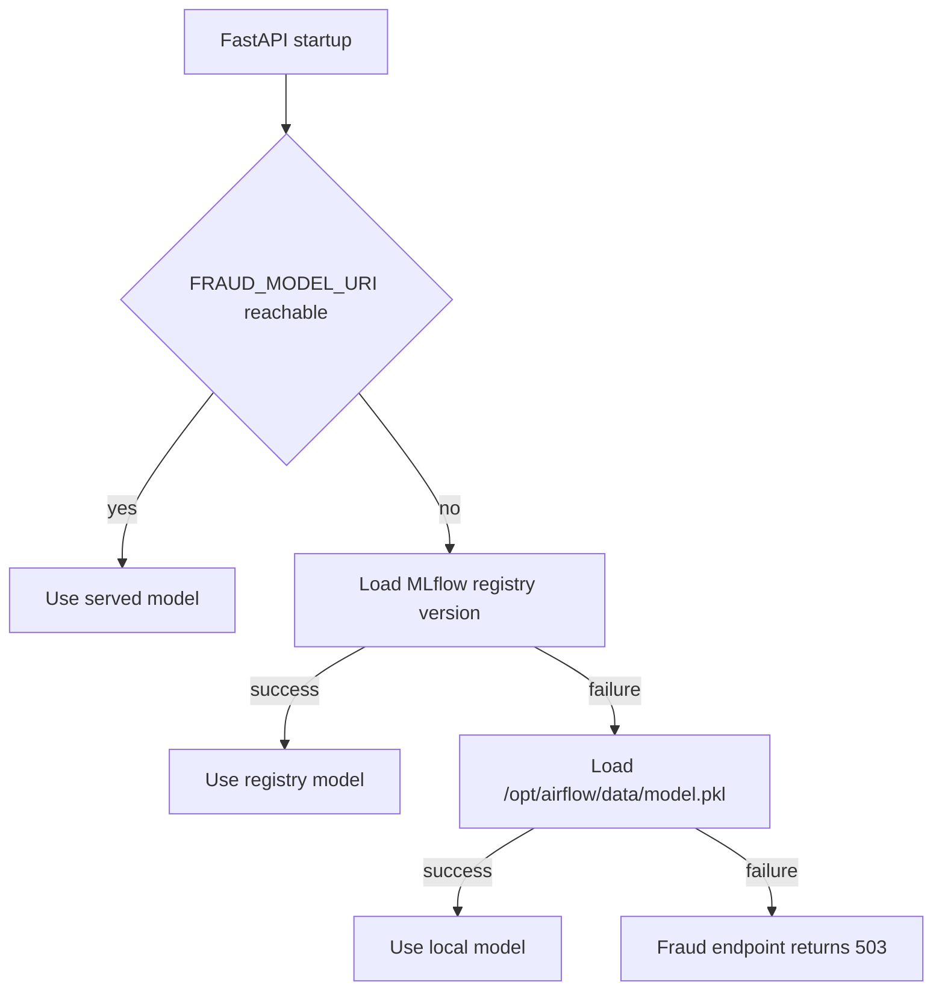

# Fraud Detection API and Model Resolution

`app.main` mounts `app.fraud.fraud_router.router` as `/fraud` with `require_api_auth`, so `POST /fraud/predict` requires the same `api-key` and `api-secret` headers as credit operations. The route uses model and encoder objects placed on `app.state` during FastAPI startup by `fraud_model.load_model()` and `load_label_encoders()`.

## Endpoint contract

`Transaction` requires string-valued `customer_age`, `name_email_similarity`, `bank_branch_count_8w`, `bank_months_count`, `credit_risk_score`, `current_address_months_count`, and `customer_id`. It accepts optional `nida_1000`, `transaction_amount`, `transaction_type`, `merchant_category`, `location`, `time_of_transaction`, `device_type`, and `is_new_account`. The implementation turns only supplied fields into a one-row DataFrame.

For every encoder key loaded from `label_encoders.pkl`, the route label-encodes a present categorical value. An unknown category does not fail; it uses the encoder's first learned class. An absent categorical value also becomes that first class. It converts these fields to floats when present: `customer_age`, `name_email_similarity`, `bank_branch_count_8w`, `bank_months_count`, `credit_risk_score`, `current_address_months_count`, and `transaction_amount`. Invalid supplied numeric strings return `400 INVALID_NUMERIC_FEATURE`; a missing numeric column becomes `0.0`.

The final feature order is the model's `feature_names_in_` when available, otherwise a short fallback list. Any model-required but missing feature is added as `0.0`. Consequently, accepting a request does **not** mean it contains all training features; defaults can materially change a prediction. Align clients with the trained transaction schema before treating results as production quality.

## Resolution chain

`load_model` first checks `<FRAUD_MODEL_URI>/ping` and accepts status `200` or `405` as a live served model. If unavailable, it sets the MLflow tracking URI and loads `models:/{MODEL_NAME}/{MODEL_VERSION}` (defaults are `FraudDetector` and `1`, despite Compose separately configuring `FRAUD_MODEL_NAME` and `FRAUD_MODEL_VERSION`). Finally it attempts `/opt/airflow/data/model.pkl`. Compose mounts `data` at `/opt/airflow/data`, so the committed artifact can be a fallback. Encoders use `ENCODER_PATH`, defaulting to the same mount. Missing or empty encoders are not automatically unavailable—an absent encoder file yields `{}`—whereas a completely failed model load makes startup set `app.state.fraud_model = None` and route dependency returns `503 FRAUD_MODEL_UNAVAILABLE`.

For a remote model, the route posts `{"inputs": records}` to `/invocations`; non-200 upstream responses become `502 SERVED_MODEL_ERROR`. For registry/local models it calls `predict` and `predict_proba` when supported. The response includes integer `fraud_prediction`, optional rounded probability, a version string derived from environment `FRAUD_MODEL_NAME` and `FRAUD_MODEL_VERSION`, and `served_from` (`served`, `registry`, or `local`).

## Training compatibility and extension seam

`airflow/jobs/train_fraud_model.py` reads `/opt/airflow/data/transactions.csv`, label-encodes every object column, persists the encoder mapping to `/opt/airflow/data/label_encoders.pkl`, trains a random forest, logs weighted precision/recall/F1 to MLflow, and registers `FraudDetector`. `fraud_detection_dag` invokes that job manually. See [training and registry](../ml/training-and-registry.md) for the full lifecycle.

A fraud feature change has a coupled surface: source dataset/generator, trainer encoding, persisted encoders, route schema/coercion/default policy, model server artifact, and a consumer request check. The tracked `generate_dummy_fraud_data.py` writes `data/transactions1.csv`, while the trainer reads `transactions.csv`; reconcile that mismatch explicitly rather than assuming the generator refreshes training input. `fastapi/app/fraud/retrain_fraud_model.py` is a standalone synthetic trainer that writes relative `data/model.pkl`/encoders and contains trailing non-Python markup, so it is not the Compose/Airflow training path.

## Focused validation

1. After an Airflow fraud training run, confirm a model registry version and matching `label_encoders.pkl` exist; then configure either the served URI or expected registry version.
2. Call `/fraud/predict` with all required numeric values parseable and representative categorical values. Verify `served_from` identifies the actual resolution path.
3. Send an invalid numeric string to prove `INVALID_NUMERIC_FEATURE`; send a novel categorical value and verify the documented first-class fallback rather than a silent schema failure.
4. If changing the transaction schema, retrain and deploy model plus encoder together. A model without its matching encoders is a compatibility break even when the route returns `200`.
