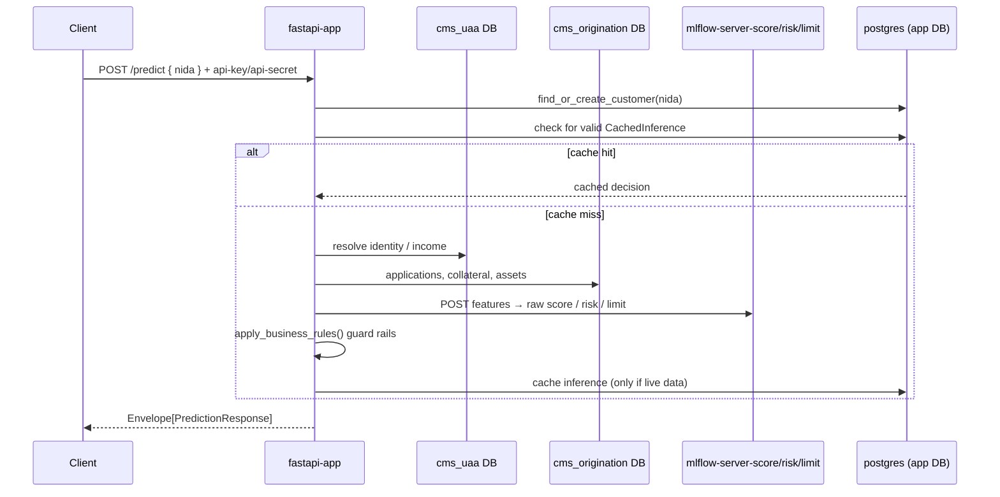

# Architecture & Services

The platform runs as a set of Docker Compose services on a shared `credit-net`
network (`docker-compose.yml`). Services fall into four groups: the **API**, the
**model-serving** layer, the **ML training** stack, and **storage**.

## Service inventory

| Service | Container | Host → Container port | Role |
|---|---|---|---|
| `fastapi-app` | `fastapi-app` | `18008 → 8000` (HTTPS) | Main API — scoring, fraud, loans, auth |
| `mlflow-server` | `mlflow-server` | `15000 → 5000`, `16060 → 6060` | MLflow tracking server + registry |
| `mlflow-server-score` | `mlflow-server-score` | `18001 → 8001` | Serves the **credit score** model |
| `mlflow-server-risk` | `mlflow-server-risk` | `18002 → 8002` | Serves the **risk** model |
| `mlflow-server-limit` | `mlflow-server-limit` | `18003 → 8003` | Serves the **credit limit** model |
| `mlflow-server-fraud` | `mlflow-server-fraud` | `18004 → 8004` | Serves the **fraud** model |
| `spark-master` | `spark-master` | `19080 → 8080`, `17077 → 7077` | Spark cluster master |
| `spark-worker`, `spark-worker2` | — | — | Spark workers |
| `postgres` | `postgres-db` | `15432 → 5432` | App + Airflow + MLflow backend DB |
| `minio` | `minio-storage` | `19000 → 9000` (S3), `19001 → 9001` (console) | S3-compatible artifact store |
| `mc-create-bucket` | `mc-initializer` | — | One-shot MinIO bucket bootstrap |
| `webserver` | `airflow-webserver` | `18087 → 8080` | Airflow UI |
| `scheduler` | `airflow-scheduler` | — | Airflow scheduler + DB migrate/user bootstrap |

The `x-airflow-common` YAML anchor shares the Airflow image/volumes across the
`webserver` and `scheduler`. DAGs, jobs, and data are bind-mounted from
`./airflow/dags`, `./airflow/jobs`, and `./data`.

## Request flow (credit scoring)

## Storage & MLflow backend

- **PostgreSQL** (`postgres-db`) backs the FastAPI app DB, Airflow metadata, and
  the MLflow tracking store. Databases are bootstrapped by `scripts/init-dbs.sh`.
- **MinIO** is the S3-compatible artifact store for MLflow models; the API and
  MLflow servers reach it via `MLFLOW_S3_ENDPOINT_URL=http://minio:9000`.

## Cross-references

- Endpoints exposed by `fastapi-app`: [API Reference](api-reference.md)
- How the three model servers are used: [Credit Scoring Engine](credit-scoring.md)
- Training/serving lifecycle: [ML Pipeline](ml-pipeline.md)
- Ports, env, and CI: [Deployment & Configuration](deployment.md)
