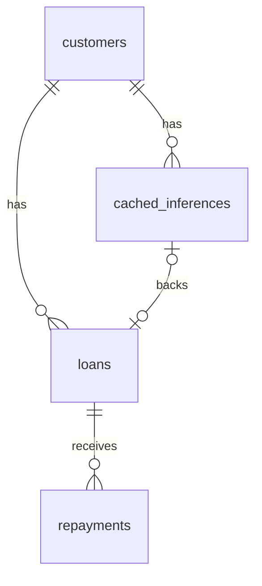

# Data Model

The service uses three PostgreSQL connections plus a set of Pydantic schemas.
ORM and API models live in `fastapi/app/models.py`; engine/session setup is in
`fastapi/app/database.py`.

## Databases (three connections)

| Connection | Purpose | Configured by |
|---|---|---|
| App DB | Owned tables (customers, inferences, loans, repayments, API clients) | `DATABASE_URL` → `postgres:5432` |
| `cms_uaa` (external) | User/identity/account source | `EXTERNAL_DB_*` |
| `cms_origination` (external) | Applications, collateral, assets, employment | `ORIGINATION_DB_*` |

`database.py` builds the app engine with `pool_pre_ping`, `pool_size=10`,
`max_overflow=20`, and a 10s connect timeout. It **fails fast** with a
`RuntimeError` if `DATABASE_URL` is unset. The external DBs are opened per-request
via FastAPI dependencies (`get_db`, `get_external_db`, `get_origination_db`).

## Owned tables (SQLAlchemy ORM)

### `customers`
`id`, `customer_id` (unique), `nida` (unique), `first_name`, `surname`,
`date_of_birth`. Has many `cached_inferences` and `loans`.

### `cached_inferences`
A stored credit assessment: `credit_score`, `decision`,
`recommended_credit_limit`, `suggested_interest_rate`, `risk_category`,
`risk_probability`, `validity_period_days`, `last_inference_date`,
`end_inference_date` (indexed — drives cache validity), `model_version`. Linked
to one `customer` and optionally one `loan`.

### `loans`
`loan_ref` (unique), `customer_id`, `inference_id`, `disbursed_amount`,
`outstanding_balance`, `disbursal_date`, `status` (default `ACTIVE`). Has many
`repayments`.

### `repayments`
`loan_ref` (FK), `amount`, `payment_date`.

### `api_clients`
`client_name` (unique), `api_key` (unique), `api_secret_hash` (bcrypt),
`is_active`, `expires_at` (null = never expires), `created_at`, `last_used_at`,
`scopes` (reserved). Backs [Authentication](authentication.md).

### `overrides`
Audit log of every guard-rail trigger that **materially changed** a decision
(added in Phase 2 of the remediation plan). Written from
`services.build_override_event`: `customer_id`, `loan_ref`, `rule_name`
(`HIGH_DTI` / `OVER_LEVERAGE` / `SUBSISTENCE_INCOME_CAP`),
`pre_override_decision`, `post_override_decision`, `pre_override_score`,
`pre_override_limit`, `post_override_limit`, `actor` (system/human),
`model_version`, `training_run_id`, `created_at`. Makes guard-rail behavior
queryable for model-risk review.

## API schemas (Pydantic)

- `PredictionRequest { nida }` → `PredictionResponse` (full decision + `data_quality`).
- `DisburseRequest { customer_id, loan_ref, amount }`.
- `RepayRequest { customer_id, loan_ref, amount }`.
- `StatusResponse { message, status, detail? }`.

All are returned inside the generic `Envelope[...]` wrapper
(`fastapi/app/utils/response.py`).

## Cross-references

- How features are read from the external DBs: [Credit Scoring Engine](credit-scoring.md)
- Endpoints that read/write these tables: [API Reference](api-reference.md)
