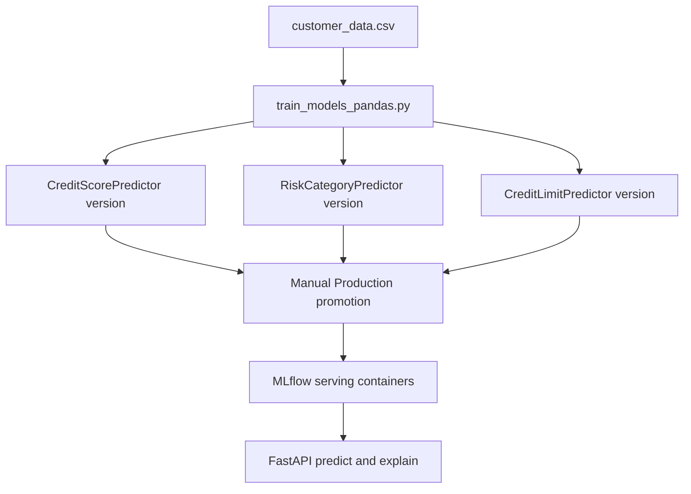

# Training Data, Models, and MLflow Registry

This repository has two model families: three credit models trained from `customer_data.csv`, and one fraud model trained from `transactions.csv`. MLflow is both tracking server and registry; Compose starts dedicated serving processes that load only Production-stage models. Airflow provides manual DAG wrappers, while a FastAPI admin endpoint can start the pandas credit trainer directly. The implementation registers versions but does not itself transition any version to `Production`.

## Credit data and sklearn training

`generate_dummy_data.py` generates 10,000 deterministic synthetic records (default seed 42), preferring `DATA_OUTPUT_PATH`, then an Airflow-readable data mount, then repository `data/customer_data.csv`. It defines the intended live-engine feature distribution: demographics, income/debt/balance, application, collateral, and categorical fields. It derives `payment_history_score` (300–850), `risk_category_target`, `is_approved`, `is_fraud`, and `is_high_risk`.

`airflow/jobs/train_models_pandas.py:train` is the deployed credit trainer. It reads `/opt/airflow/data/customer_data.csv`, drops identifiers and all target/leakage columns, uses `payment_history_score` as score target, `risk_category_target` as risk target, and `monthly_income * 3` as limit target. Its `ColumnTransformer` standardizes numeric features and one-hot encodes string features with unknown categories ignored. It trains and registers:

| Registry name | Pipeline | Evaluation metric | Artifact path |
|---|---|---|---|
| `CreditScorePredictor` | `GradientBoostingRegressor` | RMSE | `credit_score_model` |
| `RiskCategoryPredictor` | `RandomForestClassifier` | weighted F1 | `risk_category_model` |
| `CreditLimitPredictor` | `GradientBoostingRegressor` | RMSE | `credit_limit_model` |

`log_and_register_model` logs a sklearn model, creates a registered model if absent, and creates a new version from the run artifact. It deliberately does not assign a stage. Compose runs the three related model services with `models:/<name>/Production`, so a newly registered version will not affect API inference until a human promotes it in MLflow.

The API's `features.fetch_features` is the consumer boundary. It emits 22 model fields and uppercases categorical values to match generator categories. Do not add a generated/training field without updating that feature builder, its defaults, external mappings, explanation background handling, and deployed serving model together. In particular, `payment_history_score` is a target, never an inference feature; the trainer explicitly removes it to prevent leakage.

## Fraud training

`airflow/jobs/train_fraud_model.py` reads `/opt/airflow/data/transactions.csv`, label-encodes every object-typed column, saves the encoder dictionary, then trains a 100-tree `RandomForestClassifier` on every column except `fraud_bool`. It performs an 80/20 split (seed 42), logs weighted precision, recall, and F1, logs `fraud_model`, and registers `FraudDetector`. It does not set a model stage or model aliases.

`generate_dummy_fraud_data.py` creates a separate 2,000-row synthetic file at `data/transactions1.csv` with a rule-derived target; it is not read by the Airflow trainer without a rename/configuration change. `fastapi/app/fraud/retrain_fraud_model.py` is also not the canonical trainer: it independently generates 5,000 rows and writes relative pickle artifacts. Refer to [fraud detection API](../api/fraud.md) before using either alternative, because deployed inference requires encoder/model alignment.

## Alternative Spark path and explainability

`airflow/jobs/train_models.py` is an alternative Spark ML implementation submitted by `model_retraining_with_spark_operator`. It trains analogous named models from `/opt/bitnami/spark/data/customer_data.csv`, logs Spark models, and registers versions. Its feature pipeline does not exclude `payment_history_score` from numeric columns while it is also the score label, unlike the pandas trainer. Treat it as a separate, review-required path rather than an interchangeable replacement for the deployed sklearn serving contract.

`app.explainer` loads `CreditScorePredictor/Production` through `mlflow.sklearn`, so `/explain` assumes a sklearn-compatible Production model and a mounted `customer_data.csv` background. It samples no more than 50 rows, removes IDs and known targets, transforms background/input with the loaded pipeline, and uses SHAP where possible. Replacing Production score versions with a Spark model would affect this import/SHAP path as well as serving compatibility.

## Registry and artifact operations

`start-mlflow.sh` starts MLflow against PostgreSQL and `s3://mlflow/`, with MinIO passed as the S3 endpoint by Compose. It requires the PostgreSQL and object-store variables at shell startup, uses two workers, and sets 300-second Gunicorn/graceful timeouts due to large artifact/SHAP loads. The separate `mlflow/Dockerfile` pins other package versions than the start script installs at runtime; upgrade compatibility should be verified with train, serve, and explain flows rather than assumed.

The narrow infrastructure proof is `airflow/jobs/smoke_test.py`, run by DAG `mlflow_infrastructure_smoke_test`: it checks `/health`, logs a dummy text artifact, registers `SmokeTestModel`, downloads its version, and checks content. It validates registry/artifact transport but not credit prediction quality.

## Focused validation

- Regenerate data only when intentionally changing synthetic schema: `python generate_dummy_data.py`, then inspect columns before running the pandas DAG `pandas_model_training`.
- After training, inspect each run's metric and registry version; promote the intended versions manually, then restart/reload corresponding serving containers as required by runtime behavior.
- Call protected `/predict` and `/explain` against a live-data NIDA after promotion. Confirm the reported score model version is the expected Production version.
- Trigger `mlflow_infrastructure_smoke_test` after changing MLflow, MinIO, database, or Spark submission configuration.
