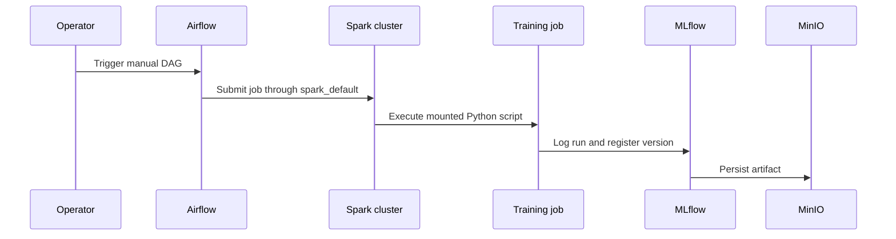

# Airflow, Spark, and Delivery Automation

Airflow is the operational entrypoint for the tracked training and infrastructure workflows. The Compose scheduler runs `airflow db migrate`, creates the configured admin user, then starts scheduling. All DAGs are either manual (`schedule_interval=None`) or one daily Spark example; none is a production cron retraining policy.

## DAG map

| DAG ID | Schedule | Task path | Purpose / caveat |
|---|---|---|---|
| `pandas_model_training` | manual | `train_models_pandas.py` | Canonical sklearn credit model training and registration. |
| `fraud_detection_dag` | manual | `train_fraud_model.py` | Canonical fraud model training, encoder persistence, and registration. |
| `model_retraining_with_spark_operator` | manual | Spark `train_models.py` | Alternative Spark credit training; needs `spark_default` connection and has different leakage semantics. |
| `mlflow_infrastructure_smoke_test` | manual | Spark `smoke_test.py` | Logs/registers/downloads a dummy MLflow artifact. |
| `sparking_flow` | `@daily` | Spark `simple_spark_job.py` | Simple word-count example, not a model workflow. |

The three SparkSubmit DAGs use Airflow connection ID `spark_default`; the repository does not define that connection, so it must be created in the Airflow deployment. The retraining DAG passes tracking and object-storage endpoint variables plus S3 settings to Spark. Its configuration includes sensitive values in Java options derived from environment variables; avoid printing task configuration/logs in environments where this exposure matters.

This represents the Spark DAG path; the pandas/fraud DAGs invoke jobs directly in the Airflow container but still log to MLflow.

## Build and deployment surfaces

- `fastapi/Dockerfile` uses Python 3.10 slim, installs `fastapi/requirements.txt`, copies `app`, and defaults to Uvicorn. Compose overrides its command to enable TLS and mounts application code/data/jobs/certificates.
- `airflow/Dockerfile` is based on Airflow 2.11 Python 3.10 and installs Airflow/Spark/MLflow/PySpark dependencies. It is the Dockerfile selected by `Jenkinsfile-dev`'s image build, even though the CI project name suggests the broader engine.
- `spark/Dockerfile` extends Bitnami legacy Spark, adds Hadoop AWS JARs and Python ML dependencies, and returns to user `1001`.
- `mlflow/Dockerfile` builds the tracking/serving image. Compose replaces its Dockerfile command with `start-mlflow.sh` for the tracking service and `mlflow models serve` for the model services.

`Jenkinsfile-dev` imports a private shared Jenkins library, checks out source metadata, builds/pushes `./airflow/Dockerfile` with context `.`, then calls a shared GitOps manifest update operation for `04-deployment.yaml`. The shared-library implementation and manifest repository are external, so this repository cannot establish deployment behavior beyond those calls. The recent history explains two operational choices: MLflow reduced to two workers with a 300-second timeout to avoid OOM/download failures, and a Docker vulnerability scan stage is commented out to unblock the pipeline.

`opa-docker-security.rego` defines policy denies for secrets in Docker `ENV`, `latest` base tags, piped curl/wget shell use, system upgrades, `ADD`, missing non-root users, root users, and `sudo`. `trivy-docker-image-scan.sh` scans the final `FROM` image with high severity non-blocking and critical severity blocking. It reads a root `Dockerfile`, but the tracked root path is a symlink loop, while Jenkins builds `airflow/Dockerfile`; do not assume that script currently scans the CI-built image without correcting its target.

`.github/workflows/openwiki-update.yml` is separate documentation automation: scheduled/manual GitHub Actions checks out full history, installs OpenWiki and Mermaid tooling, runs `openwiki code --update --print`, then opens a documentation PR. It does not run application tests or deploy services.

## Focused validation

1. Render and start the target Compose services, then use the MLflow smoke-test DAG before starting a costly training run.
2. In Airflow, verify `spark_default` targets `spark://spark-master:7077` before triggering Spark DAGs; then inspect only task logs needed for job completion/MLflow run ID.
3. Trigger `pandas_model_training`, verify three registry versions and metrics, promote deliberately, and use the API health/predict checks from [credit assessment and loans](../api/credit-and-loans.md).
4. For CI changes, validate the Jenkinsfile syntax and shared-library integration in the actual Jenkins environment; external GitOps and library code are unavailable here.
