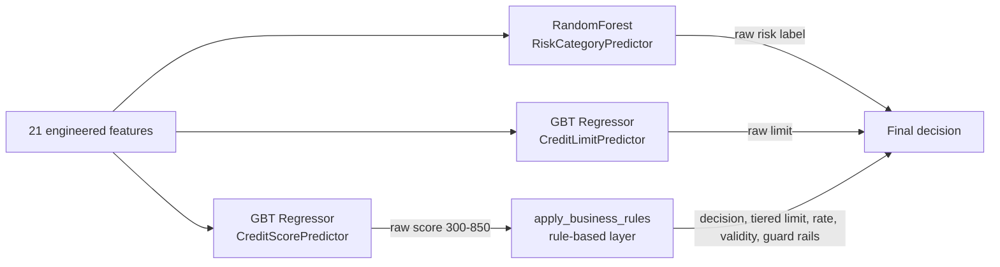

# Scoring Engine — Algorithm, Features & Assumptions

This page documents *how* the credit scoring engine actually decides — the
algorithms, the feature engineering, why these algorithms were chosen, and the
assumptions baked into them. For the request/caching flow see
[Credit Scoring Engine](credit-scoring.md).

> ## ⚠️ Model limitation disclosure (read first)
>
> The credit models are trained on **synthetic data** whose target
> (`payment_history_score`) is a **hand-written formula plus noise**
> (`generate_dummy_data.py`), **not observed repayment behaviour**. The models
> therefore learn to approximate a known scorecard, not real default risk.
>
> **Any Gini / F1 / RMSE reported today measures fit to that synthetic formula,
> not predictive power on real borrowers.** These metrics must not be presented
> to a credit committee as evidence of real-world discrimination. Real
> validation requires retraining on empirical good/bad labels (see the
> remediation plan in [Model Risk & Weaknesses](model-risk-and-weaknesses.md)).

## 1. Is it hybrid? — Yes, explicitly two-stage

The engine is a **hybrid of machine learning and a deterministic rule-based
layer**. A prediction passes through two distinct stages:



- **Stage 1 — ML models** (served via MLflow, called in `_build_credit_inference`,
  `fastapi/app/main.py`): three separately-trained models produce a raw score,
  a raw risk label, and a raw limit.
- **Stage 2 — Rule engine** (`fastapi/app/services.py::apply_business_rules`):
  clamps the score to 300–850, maps it to a decision tier, then applies
  regulatory-style **guard rails** (DTI hard-reject, over-leverage cap,
  subsistence-income cap). Guard rails can only make a decision *worse*.

The rule layer, not the ML, is what ultimately sets **decision, interest rate,
recommended limit, and validity** — the ML score is the *input signal* to those
rules. This is a classic **scorecard + policy-overlay** design.

## 2. The three models & algorithms

Defined in `airflow/jobs/train_models_pandas.py` (scikit-learn) and
`airflow/jobs/train_models.py` (equivalent Spark ML pipeline). Both register to
the same MLflow names.

| Model (registry name) | Task | Algorithm | Target | Metric |
|---|---|---|---|---|
| `CreditScorePredictor` | Regression | `GradientBoostingRegressor` (n_estimators=100) / Spark `GBTRegressor` (maxIter=10) | `payment_history_score` (300–850) | RMSE |
| `RiskCategoryPredictor` | Multiclass classification | `RandomForestClassifier` (100 trees / Spark 20 trees) | `risk_category_target` (LOW/MEDIUM/HIGH) | weighted F1 |
| `CreditLimitPredictor` | Regression | `GradientBoostingRegressor` | `monthly_income × 3` | RMSE |

### Why these algorithms?

- **Gradient-Boosted Trees for score/limit:** the features are **tabular and
  mixed** (numeric + one-hot categoricals) with **non-linear interactions**
  (e.g. income only helps if employment is stable). GBTs capture those
  interactions, are robust to unscaled/outlier numerics, need little feature
  engineering, and are the standard strong baseline for tabular regression.
- **Random Forest for risk:** the risk target is **multiclass**; RF gives native
  multiclass support, is robust to noise/imbalance, and pairs naturally with the
  same one-hot pipeline.

### Why *not* other approaches?

- **Logistic / linear regression:** too linear — would miss the
  income×employment×DTI interactions the target formula encodes.
- **Deep neural nets:** overkill for ~10k rows of tabular data; needs more data,
  more tuning, and is far less interpretable — a problem for a regulated credit
  product where you must explain declines (hence the SHAP `/explain` endpoint).
- **A single multi-output model:** score, risk, and limit are deliberately
  **decoupled** into three models so each can be retrained/served/replaced
  independently (four separate MLflow serving containers).

## 3. Features & feature engineering

The model consumes **21 features**, assembled in
`fastapi/app/features.py::fetch_features`. They group as:

| Group | Features |
|---|---|
| Demographic | `age`, `married`, `education`, `dependents`, `residense_status` |
| Employment / income | `employment_status`, `spouse_employment_status`, `monthly_income`, `avg_monthly_balance`, `savings_account_balance` |
| Credit behaviour | `credit_history_length_months`, `total_outstanding_debt`, `credit_utilization_ratio`, `number_of_late_payments_36`, `active_loans`, `debt_to_income_ratio` |
| Assets / collateral | `vehicle_ownership_status`, `vehicle_cat`, `previous_collateral_value` |
| Loan request | `requested_amount`, `loan_purpose` |

### Engineering highlights (the non-obvious logic)

- **Multi-source resolution with JSONB fallback.** Features are joined across
  `cms_uaa.user_accounts` (NIDA → uuid + income/demographics) and
  `cms_origination` (`user_party_link → party_person → loan_application →
  employment_profile / applicant_asset / collateral_item / loan_purpose`).
  Whenever a relational column is NULL, the code falls back to the rich
  `loan_application.metadata` JSONB (income history, assets, collaterals).
- **MAX-across-signals income (robustness to dirty data).** Instead of a
  priority fallback, `monthly_income` is the **max** of employment gross salary,
  6-month income-history average, metadata `monthlySalary`, and UAA income —
  because DRAFT/test apps sometimes carry typo'd tiny values (e.g. salary = 3 or
  10) that a first-non-null strategy would wrongly pick.
- **Qualifying-app filtering.** Applications with status
  `REJECTED/CANCELLED/DRAFT/WITHDRAWN` are excluded from scoring signals; DRAFTs
  never count as active loans.
- **Derived ratios.** `debt_to_income_ratio = debt / (monthly_income × 12)` and
  `credit_utilization_ratio = min(1, debt / savings)`, both guarded against
  divide-by-zero.
- **Categorical normalization.** All categoricals are upper-cased to match the
  `OneHotEncoder` categories learned at training time — mixed-case values (e.g.
  `"Employed"`) would be silently zeroed by `handle_unknown='ignore'` and lose
  their signal.
- **Data-quality reporting.** `fetch_features` never raises; it returns a
  `data_quality` dict (`uaa_source`, `score_basis`, counts) so the API can refuse
  (strict mode) or seed synthetic defaults (demo mode), and only cache
  `live_data` scores.

### Preprocessing pipeline

A scikit-learn `ColumnTransformer` inside each model `Pipeline`:
`StandardScaler` on numeric columns + `OneHotEncoder(handle_unknown='ignore')`
on categoricals (Spark uses `StringIndexer → OneHotEncoder → VectorAssembler`).

### Leakage control

The trainer explicitly drops `payment_history_score` (the score target),
`risk_category_target`, `is_approved`, `is_fraud`, `is_high_risk`, plus
`customer_id`/`nida` from the inputs. The code comments note that leaving the
score target in caused the model to "just regurgitate the default value of 500".

## 4. The critical assumption — the target is itself a rule-based formula

The models are trained on **synthetic data** from `generate_dummy_data.py`
(10,000 rows, seeded). The regression target `payment_history_score` is **not an
observed repayment outcome** — it is a hand-designed additive scorecard:

```
score = 750 (base)
        − 250 · clip(DTI − 0.3, 0, 1)          # heavy penalty when DTI > 0.3
        − 100 · credit_utilization_ratio
        −  30 · number_of_late_payments_36
        −  15 · clip(active_loans − 1, 0, 5)
        +  30  if credit_history ≥ 24 months
        + employment_bonus  (EMPLOYED +25, SELF_EMPLOYED +10, else −30)
        +  40 · clip(log10(income / 500k), 0, 2)
        + Gaussian noise (σ=15)
→ clipped to [300, 850]
```

- `risk_category_target` = **banded from the score** (≥700 LOW, ≥500 MEDIUM, else HIGH).
- `is_approved` = score ≥ 640; `is_high_risk` = risk == HIGH.

**Implication:** the GBT/RF models are effectively **learning to approximate a
known, rule-based scorecard** (plus noise), not real-world default behaviour.
This is fine for a demo/reference implementation, but it means the ML adds little
predictive information beyond the formula — a key thing to flag before using this
in production with real outcomes.

## 5. Assumptions, redundancies & limitations to be aware of

- **Synthetic ground truth.** Models learn a designed formula, not empirical
  defaults. Real deployment requires retraining on actual repayment labels.
- **Score ↔ risk redundancy.** Both the `RiskCategoryPredictor` and the rule
  layer derive risk from the score band. The API uses the model's `raw_risk` if
  present, otherwise the rule-derived category (`_build_credit_inference`).
- **Limit is largely overridden.** `CreditLimitPredictor` targets `3× income`,
  but `apply_business_rules` re-derives the limit as a tier multiple
  (1.5×–5× income) and caps it — so the ML limit is mostly superseded by policy.
- **Stochastic outputs within a tier.** `risk_probability` and `interest_rate`
  are drawn with `random.uniform` inside each score band, so an identical score
  yields slightly different rates/probabilities per call (`services.py`).
- **Graceful degradation → randomness.** If a model server is unreachable,
  `_build_credit_inference` falls back to a random score in `[300, 850]`; such
  scores are flagged non-`live` and are **not cached**.
- **Currency conversion is a no-op.** `USD_TO_TZS_RATE = 1` in `main.py` — limits
  are labelled TZS but not actually converted.

## Cross-references

- **Weaknesses & remediation:** [Model Risk & Weaknesses](model-risk-and-weaknesses.md)
- Serving/caching/decision flow: [Credit Scoring Engine](credit-scoring.md)
- Tier tables & guard rails: [Credit Scoring Engine](credit-scoring.md#3-business-rules--guard-rails-fastapiappservicespy)
- Where models are trained & registered: [ML Pipeline](ml-pipeline.md)
- Explainability endpoint: [API Reference](api-reference.md)
